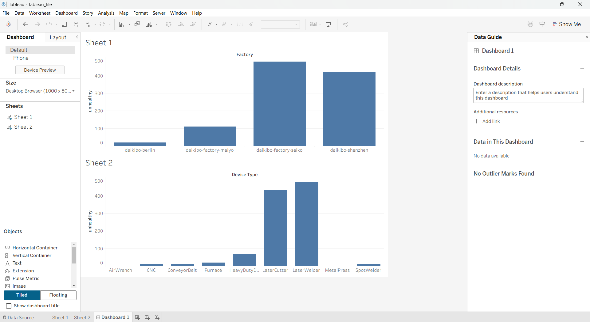

# Hi there, I'm Amber Awasthi 👋

## 🚀 About Me

I'm a Bachelor of Business Administration (BBA) student with a strong interest in **Data Analytics, Business Intelligence, Artificial Intelligence, and Human Resource Management**.

I enjoy solving business problems using data and continuously work on improving my technical and analytical skills through projects, certifications, and practical experience.

---

## 💼 Professional Experience

### Data Annotator (Freelance)
**iMerit Technology Services** | Remote

- Annotated and validated AI datasets for Machine Learning models.
- Maintained high data quality standards.
- Worked with structured and unstructured datasets.
- Collaborated with technical teams to improve dataset accuracy.

### Human Resources Intern
**Shivkashi Industries Pvt. Ltd.**

- Candidate sourcing and resume screening
- Interview scheduling
- Employee onboarding
- HRMS operations
- Workforce documentation

---

## 📂 Projects

### 📊 Deloitte Data Analytics Virtual Experience
- Built interactive Tableau dashboards.
- Performed operational data analysis.
- Created executive-level business insights.
- Used Microsoft Excel for statistical analysis.

**Repository:**
https://github.com/amberawasthi-stack

---

## 🤖 Perceptron AI

- Designed and developed an AI-powered chatbot web application from scratch.
- Integrated Botpress Cloud to provide intelligent, real-time conversational responses.
- Created a responsive and modern interface using HTML, CSS, and JavaScript.
- Successfully deployed the application on GitHub Pages for seamless public accessibility.
- Showcases expertise in chatbot development, web technologies, and cloud-based deployment.

## 📸 Project Preview

.png)

**Tech Stack:** HTML • CSS • JavaScript • Botpress Cloud • GitHub Pages

🌐 **Live Demo:** https://amberawasthi-stack.github.io/Perceptron-AI/

📂 **GitHub Repository:** https://github.com/amberawasthi-stack/Perceptron-AI

---

### 🎲 Dice Rolling Game (Python)

A command-line Python application demonstrating:

- Object-Oriented Programming
- Random module
- Input validation
- Clean and modular code

**Repository:**
https://github.com/amberawasthi-stack/dice_rolling_game_python

---

## 🛠 Technical Skills

### Data Analytics
- SQL
- Tableau
- Microsoft Excel
- Data Visualization
- Business Analytics
- Predictive Analysis

### Programming
- Python
- HTML
- CSS

### HR & Business
- HRMS
- ATS
- Workforce Management
- Employee Onboarding

### Digital Marketing
- Social Media Marketing
- Campaign Analytics
- Performance Tracking

---

## 📜 Certifications

- Social Media Marketing – HP LIFE
- Python Developer Complete Course – Udemy
- Deloitte Data Analytics Job Simulation (Forage)
- GE Aerospace HR Job Simulation (Forage)
- Tata IAM & AI/Data Analytics Simulations (Forage)

---

## 🎓 Education

**Bachelor of Business Administration (BBA)**
Lucknow University
(Expected Graduation: 2027)

---

## 🏆 Achievement

🏅 All Rounder Award

Recognized for leadership, academics, and extracurricular excellence.

---

## 📫 Connect With Me

📧 Email: amberawasthi7@gmail.com

💻 GitHub: https://github.com/amberawasthi-stack

📍 Lucknow, Uttar Pradesh, India

---

⭐ *Thank you for visiting my profile! Feel free to explore my repositories and connect with me.*
